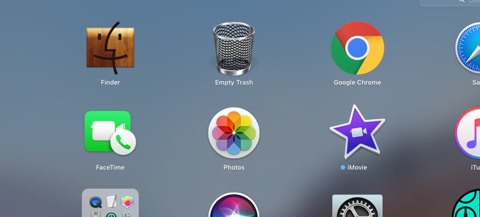

osx-app-extensions
==================
- use Automator to edit the applications which will allow you to modify the script.
- change the icons to whatever you desire

Stuff that OSX should have

Below image is from LaunchPad yay!!

Add these Automator Scripts to your /Applications they will will now be launchable via launcher as well.
